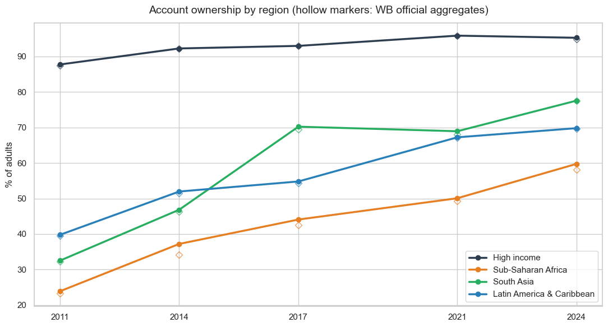
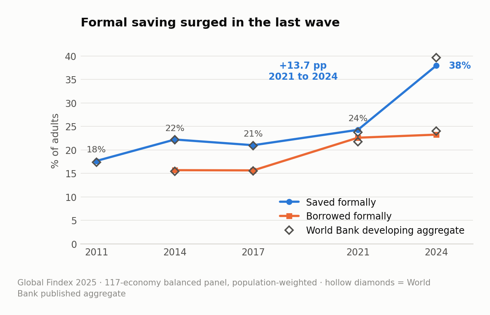
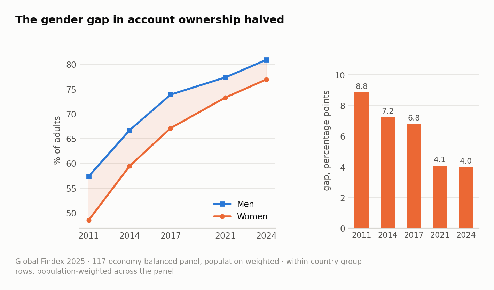

# Financial inclusion 2011–2024: a Global Findex analysis

What happened to financial access, usage and resilience worldwide over the last decade? An end-to-end analysis of the World Bank's **Global Findex Database 2025** — 162 economies, five survey waves (2011–2024) — built on a balanced country panel and validated, series by series, against the World Bank's own published aggregates.

**Everything lives in [02_Notebooks/financial-inclusion-findex-2025.ipynb](02_Notebooks/financial-inclusion-findex-2025.ipynb).**

## Key findings

- **Access is the success story.** Account ownership rose from 51% of adults in 2011 to 79% in 2024. South Asia (33% → 78%) and Sub-Saharan Africa (24% → 60%) converged fastest; in Sub-Saharan Africa the on-ramp is mobile money (44% of adults by 2024).

  

- **Usage finally caught up in the last wave.** Digital payments reached 61% of adults in developing economies, and formal saving — flat for a decade — **surged ~14 pp between 2021 and 2024**, the largest wave-to-wave change in the Findex series, largely over mobile-money rails.

  

- **Resilience is the unfinished agenda.** The share of adults in developing economies who could raise emergency funds was broadly flat (~55%): access expanded much faster than the financial security it is meant to enable.

- **Gaps narrowed but persist.** The global gender gap in account ownership halved to 4.0 pp; the income gap (10.5 pp) remains the wider divide.

  

## Methodology

- **Balanced panel:** all headline series use the 117 economies present in every survey wave (96.5% of the surveyed adult population) so that trends reflect behavior, not a changing country mix. The 16 economies whose 2021-round fieldwork slipped to 2022 are merged into the 2021 wave, following World Bank practice.
- **Population-weighted aggregation:** country values are weighted by adult population, matching World Bank methodology.
- **Validation as a first-class step:** the dataset ships with the World Bank's own aggregate rows (world, regions, income groups). Every headline chart carries them as hollow markers; the panel deviates from the official world series by at most 1.5 pp, with the direction explained by the World Bank's imputation of non-surveyed economies.
- **Deliberate handling of data gaps:** mobile money is only surveyed where such services operate — averaging only surveyed economies overstates the global figure almost 2× (28.5% vs the official 16.0% in 2024). Digital-payment data covers just 5 of 40 high-income panel economies in the 2024 wave, so that line ends in 2021 instead of faking a trend.

This analysis started as the empirical chapter of my bachelor's thesis. Rebuilding it with the validation pipeline above surfaced five substantive errors in the original version — including two trend signs that flipped once the country composition was held fixed and the disaggregation rows were filtered correctly. Section 7 of the notebook documents each one; they are a better lesson in aggregation discipline than any textbook example I know.

## Working paper

The analysis is also written up as a working paper: **"Access Without Depth: Financial Inclusion 2011–2024 and Aggregation Pitfalls in the Global Findex Database 2025"** — [PDF](04_Paper/findex_2025_working_paper.pdf). Beyond the trends, the paper formalizes four aggregation pitfalls in the Findex country file and shows that while each biases levels by only 1–2 percentage points in isolation, plausible combinations reverse the sign of headline trends. Every figure, table and statistic in the paper is regenerated by two scripts in [04_Paper/](04_Paper) (`make_paper_assets.py` → `build_paper.py`).

## Repository

```
01_Data/        Global Findex Database 2025 (World Bank, country-level CSV)
02_Notebooks/   the analysis notebook
03_Outputs/     exported figures
04_Paper/       working paper (PDF + docx) and its reproduction scripts
```

## Running it

```bash
pip install -r requirements.txt
jupyter notebook 02_Notebooks/financial-inclusion-findex-2025.ipynb
```

## Data & citation

Global Findex Database 2025, World Bank — [worldbank.org/globalfindex](https://www.worldbank.org/en/publication/globalfindex).
Klapper, L., Singer, D., Starita, L., & Norris, A. (2025). *The Global Findex Database 2025: Connectivity and Financial Inclusion in the Digital Economy.* Washington, DC: World Bank.

---
*Developed in collaboration with Claude (Anthropic).*
