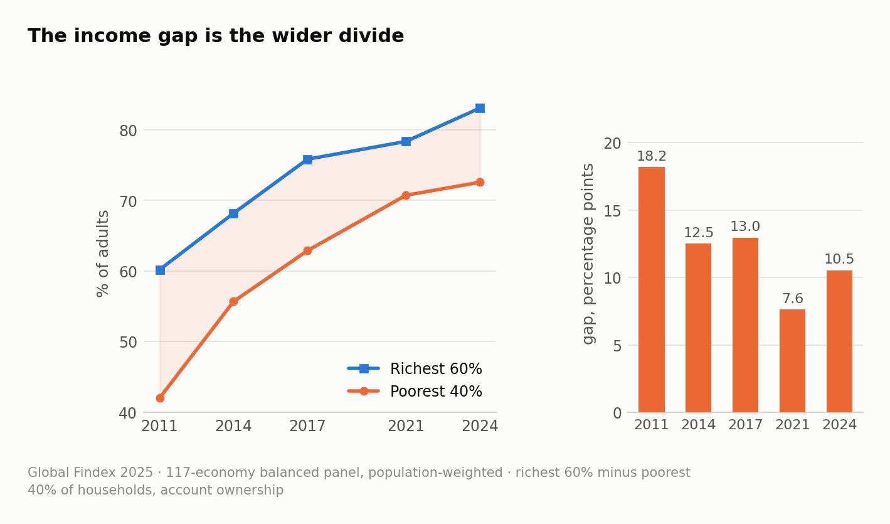
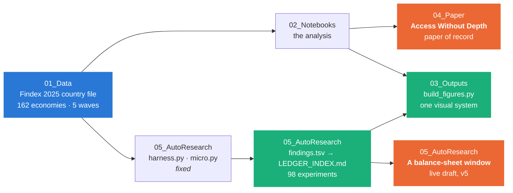
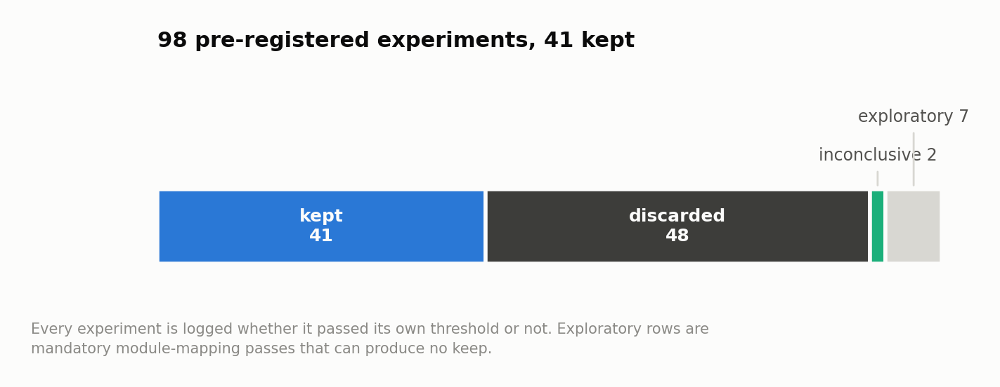
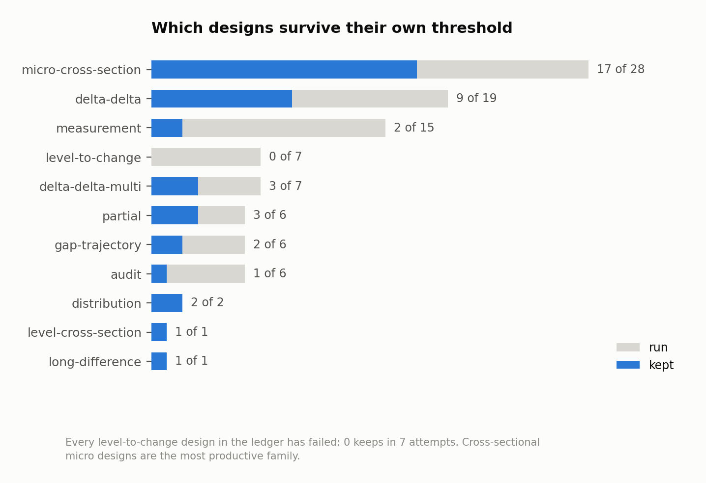
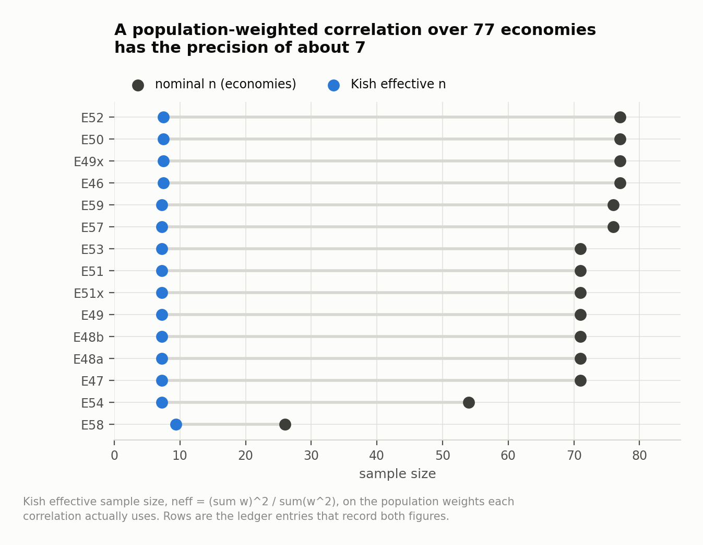

# Financial inclusion, 2011–2024

**What happened to financial access, usage and resilience worldwide over the last decade — and
how much of the answer depends on how you aggregate?**

An end-to-end analysis of the World Bank's **Global Findex Database 2025**: 162 economies, five
survey waves, built on a balanced country panel and validated series by series against the World
Bank's own published aggregates. Plus a second project layered on top of it — a pre-registered
research loop that has now run **98 experiments** and discarded roughly half of them on purpose.

<picture><source media="(prefers-color-scheme: dark)" srcset="03_Outputs/figures/dark/fig2_regional_account.png"></picture>

---

## Start where you like

| | | |
|---|---|---|
| 📓 | **[The analysis](02_Notebooks/)** | one notebook, raw file to headline series, validation inline |
| 📄 | **[*Access Without Depth*](04_Paper/)** | the finished working paper — trends, and four aggregation pitfalls that can reverse them |
| 🔬 | **[The research loop](05_AutoResearch/)** | 98 pre-registered experiments, kept **and** discarded, and a second live paper |
| 📊 | **[Figures](03_Outputs/)** | 13 charts, light and dark, one checked visual system |

Every folder has its own README stating what it contains and what its contract is.

---

## What the data says

**Access is the success story — and it is nearly done.** Account ownership went from **51.4%** of
adults in 2011 to **78.9%** in 2024: 2.43 billion adults with an account to **4.39 billion**. South
Asia (33% → 78%) and Sub-Saharan Africa (24% → 60%) converged fastest.

**Usage finally caught up in the last wave.** Digital payments reached **60.9%** of adults in
developing economies. Formal saving — flat for a decade at 18–24% — **jumped 13.7 points between
2021 and 2024**, to 38.0%. It is the largest wave-to-wave movement of any margin Findex has
measured since 2011.

<picture><source media="(prefers-color-scheme: dark)" srcset="03_Outputs/figures/dark/fig6_saving_borrowing.png"></picture>

**Resilience is the unfinished agenda.** The share of adults in developing economies who could
raise emergency funds was **54.7% in 2021 and 54.5% in 2024** — flat, while access expanded
underneath it. Access grew much faster than the financial security it is meant to enable.

**Gaps narrowed, and the wider one is not the one people name.** The gender gap in account
ownership more than halved, **8.8 pp → 4.0 pp**. The income gap is **10.5 pp** — still the wider
divide, and it widened again between 2021 and 2024.

<picture><source media="(prefers-color-scheme: dark)" srcset="03_Outputs/figures/dark/fig10_income_gap.png"></picture>

---

## How it is built



Four methodological commitments, applied everywhere:

- **Balanced panel.** All headline series use the **117 economies present in every wave** (96.5% of
  the surveyed adult population), so a trend reflects behaviour and not a changing country mix. The
  16 economies whose 2021 fieldwork slipped into 2022 are merged into the 2021 wave.
- **Population-weighted aggregation**, matching World Bank methodology.
- **Validation as a first-class step.** The dataset ships with the World Bank's own aggregate rows;
  every headline chart carries them as hollow diamonds. The panel deviates from the official world
  account series by at most **1.5 pp**, and the direction is explained by the Bank's imputation of
  non-surveyed economies.
- **Data gaps handled out loud.** Mobile money is only surveyed where such services operate —
  averaging only surveyed economies puts world 2024 at **28.5%** against the official **16.0%**,
  nearly double. Digital-payment data covers just 5 of 40 high-income panel economies in 2024, so
  that line stops in 2021 rather than faking a trend.

This began as the empirical chapter of my bachelor's thesis. Rebuilding it with the pipeline above
surfaced **five substantive errors** in the original, including two trend signs that flipped once
country composition was held fixed. Section 7 of the notebook documents each one.

---

## Two papers, and they are not the same paper

The repository holds two write-ups. They share a dataset and a methodology and nothing else.

| | **[*Access Without Depth*](04_Paper/)** | **[*A balance-sheet window*](05_AutoResearch/PAPER_DRAFT_v5.md)** |
|---|---|---|
| **Asks** | what happened 2011–2024, and how aggregation choices distort the answer | what the 2021–24 saving surge was made of, and what moved with it |
| **Method** | one analysis, validated series by series | 98 pre-registered experiments, kept and discarded |
| **Status** | **finished** — [PDF of record](04_Paper/findex_2025_working_paper.pdf) | **live** — draft v5, rewritten whenever the ledger outgrows it |
| **Regenerates from** | `paper_stats.json` | `findings.tsv` + the fixed harness |

The second grew out of the first: the pitfall taxonomy in *Access Without Depth* became the rigor
gates the research loop cannot skip. Neither supersedes the other.

---

## The research loop

[`05_AutoResearch/`](05_AutoResearch/) runs pre-registered experiments against the same data and
logs every one of them. The point is the discipline, not the volume: each experiment states its
hypothesis, its exact test and its keep threshold **before** the answer is computed, a fixed
harness makes the rigor gates impossible to skip, and results that fail their own bar are recorded
as results rather than quietly dropped.

<picture><source media="(prefers-color-scheme: dark)" srcset="03_Outputs/figures/dark/ledger_outcomes.png"></picture>

Three things it found that the notebook could not:

**Replication is where claims go to die.** Every *level-to-change* design in the ledger has
failed — **0 keeps in 7 attempts**. The *partial* designs did produce three keeps, but every one
of them that was later put to a replication or promotion test failed, which is why all three are
still **window** claims rather than general ones. What survived did so because it was tested
across wave transitions rather than inside a single one.

<picture><source media="(prefers-color-scheme: dark)" srcset="03_Outputs/figures/dark/ledger_designs.png"></picture>

**Population weighting is doing more work than it looks.** A population-weighted correlation over
~77 economies has a Kish effective sample size near **7** — so the ledger now reports the
unweighted twin beside every weighted statistic, and names the single economy whose removal moves
the result most.

<picture><source media="(prefers-color-scheme: dark)" srcset="03_Outputs/figures/dark/ledger_neff.png"></picture>

**Denominators drift.** Six economies stop reporting individual survey items between 2021 and 2024
while remaining in the wave. On the affected items this manufactures apparent co-movement — three
of four margins in one module stop moving at all once the economy set is held fixed.

---

## Repository

```
01_Data/          the Global Findex 2025 country file (path is a contract — see its README)
02_Notebooks/     the analysis notebook
03_Outputs/       figures + the shared visual system and its palette validator
04_Paper/         Access Without Depth — PDF, docx, and the scripts that regenerate both
05_AutoResearch/  the pre-registered loop: protocol, harness, ledger, logs, live draft
```

## Running it

```bash
pip install -r requirements.txt
jupyter notebook 02_Notebooks/financial-inclusion-findex-2025.ipynb
```

```bash
python3 03_Outputs/build_figures.py && python3 03_Outputs/build_ledger_figures.py
```

## Data & citation

Global Findex Database 2025, World Bank —
[worldbank.org/globalfindex](https://www.worldbank.org/en/publication/globalfindex).
Klapper, L., Singer, D., Starita, L., & Norris, A. (2025). *The Global Findex Database 2025:
Connectivity and Financial Inclusion in the Digital Economy.* Washington, DC: World Bank.

The individual-level microdata used by the research loop is licensed for research use with no
redistribution. It is gitignored and has never been committed here; only aggregates and findings
derived from it are published.
